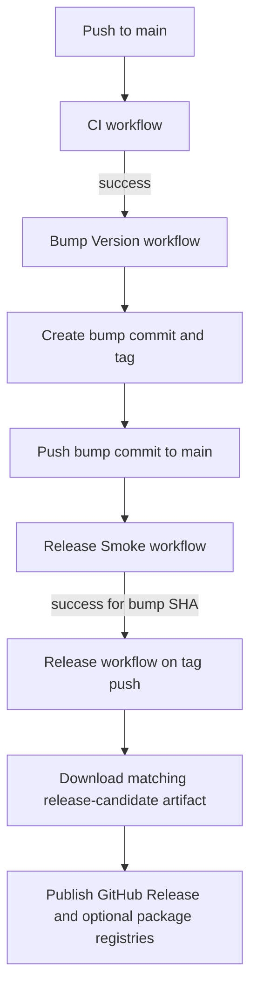

# Release Verification

This checklist is the manual gate before enabling automatic version bumping.

## Latest known-good checkpoints

- Release Smoke green on `main`: `e14138c478cba0502ea98cc259d710fa36b03b2f` ([workflow run](https://github.com/aryaminus/controlkeel/actions/runs/23857297933), 2026-04-01)
- Tag-triggered Release green: `e14138c478cba0502ea98cc259d710fa36b03b2f` (`v0.1.13`, [workflow run](https://github.com/aryaminus/controlkeel/actions/runs/23857298249))
- GitHub release assets published correctly: `e14138c478cba0502ea98cc259d710fa36b03b2f` (`v0.1.13`, [GitHub Release](https://github.com/aryaminus/controlkeel/releases/tag/v0.1.13))

Re-verify after each release: confirm the latest successful [Release Smoke](https://github.com/aryaminus/controlkeel/actions/workflows/release-smoke.yml) on `main` and the latest tag-triggered [Release](https://github.com/aryaminus/controlkeel/actions/workflows/release.yml), then refresh the checkpoints above.

Keep this file on the latest confirmed green SHAs before relying on `CONTROLKEEL_RELEASE_AUTOTAG_ENABLED`.

`Release Smoke` is the canonical release-candidate build for a SHA. Tag-triggered `Release` should publish the matching smoke artifact set for that same SHA instead of rebuilding binaries again.

## Workflow topology

Guardrails for cost and correctness:

- CI runs on normal pushes and PRs, and is the inexpensive gate.
- Release Smoke is the expensive cross-platform packaging gate, and runs for release bump commits (or manual dispatch).
- Tag-triggered Release must find a successful Release Smoke run for the exact tag SHA.
- If Release Smoke for that SHA is completed but not successful (for example `skipped`), Release should fail fast.

## Checklist

1. Confirm the latest [Release Smoke](https://github.com/aryaminus/controlkeel/actions/workflows/release-smoke.yml) run on `main` is green for Linux, macOS Intel, macOS Apple Silicon, and Windows smoke.
2. Confirm the latest tag-triggered [Release](https://github.com/aryaminus/controlkeel/actions/workflows/release.yml) run is green and uploaded all Burrito artifacts.
3. Verify the packaged install path matches current docs:
   - `controlkeel`
   - `controlkeel attach opencode`
   - `controlkeel findings`
   - `controlkeel status`
   - raw installer scripts from `raw.githubusercontent.com` still install the latest release
4. Verify the OpenCode quick-start and provider/no-key guidance in `README.md` and `docs/getting-started.md` still match runtime behavior.
5. Verify release notes/changelog content matches the tagged version.
6. Set repository variable `CONTROLKEEL_RELEASE_AUTOTAG_ENABLED=true`.
7. Ensure `PAT_TOKEN` is configured so the bump workflow can push commits and tags that trigger downstream workflows.
8. If Homebrew publication is enabled, ensure `HOMEBREW_TAP_TOKEN` can push to `aryaminus/homebrew-controlkeel`.
9. If npmjs publication is enabled, ensure `NPM_TOKEN` is configured for `@aryaminus/controlkeel`.
10. Confirm `publish-github-packages` succeeds in [release.yml](../.github/workflows/release.yml) so the bootstrap package is also available via GitHub Packages.
11. Confirm the Homebrew tap formula resolves to the tagged release assets and the npm bootstrap package downloads the matching binary assets for supported platforms.

## npmjs publish token setup (maintainers)

Use this once per token rotation. End users do not need any token for `npm i -g @aryaminus/controlkeel` or `npx @aryaminus/controlkeel@latest`.

1. Sign in to npm and open **Access Tokens**.
2. Create a new **granular access token** from the npm website.
3. Grant package permission for `@aryaminus/controlkeel` with **Read and write**.
4. Set an expiration date and keep the scope as narrow as possible.
5. If your npm account enforces write-time 2FA, enable **Bypass 2FA** for this CI publish token.
6. Copy the token immediately (npm only shows the full token once).
7. In GitHub, open repository **Settings -> Secrets and variables -> Actions**.
8. Create or update repository secret `NPM_TOKEN` with the token value.
9. Verify `.github/workflows/release.yml` publishes npm with `NODE_AUTH_TOKEN: ${{ secrets.NPM_TOKEN }}`.
10. Trigger the next tag release and confirm `publish-npm` succeeds.

### References

- npm: [Creating and viewing access tokens](https://docs.npmjs.com/creating-and-viewing-access-tokens)
- npm: [Using private packages in a CI/CD workflow](https://docs.npmjs.com/using-private-packages-in-a-ci-cd-workflow)
- npm: [Configuring two-factor authentication](https://docs.npmjs.com/configuring-two-factor-authentication)
- GitHub: [Using secrets in GitHub Actions](https://docs.github.com/en/actions/how-tos/write-workflows/choose-what-workflows-do/use-secrets)
